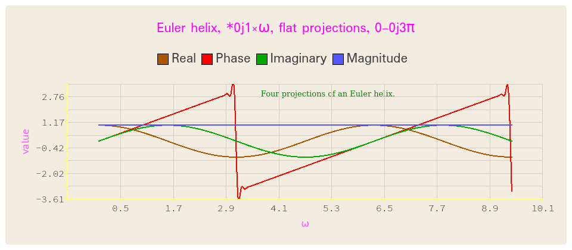

# qapl

qapl is a Qt-based interface to GNU APL.  In effect, it replaces the terminal
emulator in which APL is usually run but offers the following additional
capabilities:

+ Access to external editors such as emacs or gvim.
+ GUI-style access to APL )load, )save, )copy, etc., operations.
+ A &gt;&gt; function to export expression results to a file or a >>> to
append to a file.
+ A |> function to call an external function, and capture the results.

qapl offers two major capabilities, a terminal emulator for user interaction,
and a means of using external editors like emacs and gvim to edit APL
functions and lambda.

As a terminal emulator, qapl interfaces with the APL engine through libapl,
avoiding potential interactions with the standard APL CLI.  For the editor
interface, qapl uses Qt processes rather than APL native functions and
operating system processes.

<h1>Usage</h1>

<h2>Output redirection and pipes</h2>

qapl provides what look like two additional APL functions, though they're
implemented in qapl rather than in the APL engine.

<h3>File redirection:  >> and >>></h3>

The first of these functions, in dyadic operation, provides redirection of its
left expression to an external file.  For example, 

<p style="text-align: center;">⍳8>>fubar</p>

will create file fubar containing:

<p style="text-align: center;">0 1 2 3 4 5 6 7</p>

Files maybe appended with the >>> operator:

<p style="text-align: center;">⍳8>>fubar</p>

results in:
<p style="text-align: center;">0 1 2 3 4 5 6 7<br>0 1 2 3 4 5 6 7</p>

The redirection function can also be used monadically:

<p style="text-align: center;">>>fubar</p>

Which will leave the file in existence but will make it zero length.

<h3>Piping:  |></h3>

The piping function pipes the results of the left expression to the given
external command and any standard output of that command will be captured.
For example:

____________
```
	⍳8|>wc
1       8      16
```
____________

Arguments may be provided as well:

```


	|>wc -w -l
1       8
```


The output can be assigned to an APL variable:

____________
```
	⍳8|>z←wc -w -l
      z
1 8

      ⍴z
2
```
____________


If a command doesn't accept or doesn't need standard input, the left argument
may be omitted:

____________
```
      |>date
Fri Oct  8 02:20:49 PM EDT 2021
```
____________

If the standard output of a command is a string, as in this case, the output
may be assigned to a variable by enclosing the command in quotes:

____________
```
      |>z←'date'
      z
Fri Oct  8 02:23:34 PM EDT 2021
```
____________

(This also works with numeric output:

____________
```
      ⍳8|>z←wc -w -l
      z
1 8

      ⍴z
2

      ⍳8|>z←'wc -w -l'
      z
      1       8

      ⍴z
15
)
```
____________

The exit code of the given command can be captured by using a "←+" assignment:

____________
```
      |>z←+'date'
      z
 0 Sat Oct  9 09:15:08 AM EDT 2021 

      ⍴z
2

      1↑z		⍝ exit code
0

      1↓z		⍝ encapsulated result
 Sat Oct  9 09:15:08 AM EDT 2021
```
____________

Argument substitutions maybe made to piped commands through the use of
backquotes:

____________
```
      opta←'-w'
      optb←'-l'
      ⍳8|>wc
      1       8      16

      ⍳8|>wc `opta` `optb`
      1       8

      optb←'-c'
      ⍳8|>wc `opta` `optb`
      8      16
```
____________

or

____________
```
      arga←'this is a string'
      |>echo `arga`
"this is a string"

      arga←'this is a different string'
      |>echo `arga`
"this is a different string"
```
____________

or

____________
```
      |>echo `'iota 8 equals '`  `⍳8`
 iota 8 equals   "0 1 2 3 4 5 6 7"
```
____________

<h3>Input line</h3>

The input line keeps a history (of course) that can be accessed not only
with the Up and Down arrows but with the mouse wheel as well.

A number of GNU APL function are irrelevant in qapl, but ]help pops up
a window containing information shamelessly stolen from the GNU APL source.
Help&rArr;Symbols on the menu bar does the same thing.

<h4>Editors</h4>

The standard APL ∇ editor doesn't work under qapl, being replaced by external
editors like emacs, gvim, and probably other editors that open their own
windows.  qapl uses emacs as its default editor, but it includes
gvim&mdash;selectable under Settings&rArr;Editor menu option&mdash;and other
editors can be set by hand or in an initialisation file.  (See below.) The
presently selected editor may be opened, as usual, by ∇_functionname_.  To
edit a lambda, the editors can be opened using double ∇s: ∇∇_lambdaname_
(Double ∇s are only necessary on the initial invocation; thereafter, qapl
figures it out.)  (Note that only the lambda body can be specified in the
editor.  Using as an example the lambda shown below:

<p style="text-align: center;">sin   ← {1○⍵}</p>

editing ∇sin will show only the "1○⍵".  When saved from the editor, gapl will
generate all the stuff necessary to create the lambda.)

Settings&rArr;Editor can be used to select an existing editor invocation or it
can be used to enter a new one.  In the latter case, it, like several other
settings will be saved in t Qt settings file.  (Saved settings are: the log
window and input line foreground and background colours, the font family and
point size, the editor string, and the qapl window height and width.  Except
for the last two, these are all set in the Settings menu.  The width and height
are the last size the qapl window was set to.)

<h3>Initialisation</h3>

<h4>Command line</h4>

qapl has four options:

* &ndash;&ndash;noCONT
   - suppress loading the CONTINUE workspace if it exists
* &ndash;&ndash;noSETUP
   - suppress loading the SETUP workspace if it exists
* &ndash;&ndash;noINIT
   - suppress processing the qapl initialisation file
* &ndash;L ws
   - load the specified workspace

Following these options, qapl will accept any number of arguments that will be
interpreted as files containing either scripts of the format described below
or exported XML, also as described below.  Any file ending in ".plot" will be
interpreted as XML; anything else will be interpreted as a script.

<h4>Initialisation file</h4>

In addition to loading the SETUP or CONTINUE workspaces, qapl can be
initialised with a human-readable text file containing a mix of APL
expresssions and qapl settings and options.  For example:

____________
```
sin   ← {1○⍵}
sind  ← {1○○⍵÷180}
sinr  ← {1○○⍵}
asin  ← {¯1○⍵}
asind ← {(¯1○⍵)÷(○÷180)}
asinr ← {(¯1○⍵)÷(○1)}

#etc

!'Hi there!  It''s', ⎕ts

qapl editor+ emacs --geometry=40x20  -background '#ff0000' -font "Monospace"
qapl nocont
qapl nosetup
```
____________

Aside from the last three, discussed below, these are all simpply passed to
APL.  (In this case, obviously, to create a number of lambdas.  I've been
using APL for half a century and still can't remember which the
circle-function number does what...)  By default, any output from these
statements is suppressed, but if the statement is preceded by an exclamation
point, like the "!'Hi there!...'", the output is shown.

Lines that start with the string "qapl" (case insensitive) are qapl
directives:

* editor+
  - When this directive is encountered, the remainder of the line following
the directive (and any following immediately whitespace) will be stored in a
list of additional editor invocations and made available as an optional editor
selection in Settings&rArr;Editor.
* nocont
  - suppresses loading the CONTINUE workspace.
* nosetup
  - suppresses loading the SETUP workspace.

All of these are case-insensitive.

Blank lines and any line that starts with # is ignored.

See the sample qaplinit.txt file included with this package.

<h1>Plotting</h1>

The other major feature of qapl is integrated interactive plotting, entered by
hitting Plot on the menu bar.  At the moment, only 2D plots are supported; 3D
plots will be added later.  2D plot controls can be entered by hitting 2D Plots
under the Plot menu, which will get you the following panel:

<h2>2D Plots</h1>

<p align="center">

</p>

The first entry is the APL expression to be evaluated.  It should be an
expression that accepts either a real or complex vector (a simple example
being 1○ix where ix is the numeric vector) and evaluate to a numeric vector.
The resultant sequence of pairs from ix and the evaluation result are what will
be plotted.

The enty "Index var" should contain the variable used in the expression, ix in
this case, and the two following fields the initial and final values of the
index vector.  (How that vector is generated will be addressed in a moment.)
Each of those fields may contain a complex number.

Clicking the up and down arrows increment and decrement the real components
of the values, and the keyboard up and down arrows and the mouse wheel will do
the same thing.  Holding down the control key while doing any of that will
increment or decrement the imaginary portion.

Values may be entered manually, in any normally accepted fixed or floating
point format, with the extra feature that a value affixed with a 'p' (or 'P')
will be interpreted as a coefficient of π&mdash; "2p" will be evaluated as 2π;
"0j-2p" would evaluate as -2πi.

Complex values may also be entered in radial form as magnitude<phase: "2<1"
would evaluate as a complex value of magnitude 2 at a phase angle of 1 radian.
The phase angle may be suffixed with 'p', 'P', or '○', resulting in
interpretation, as above, as a coefficient of π, with 'd' or 'D', resulting in
interpretation as degrees, or with 'r' or 'R' as radians.

The index vector mentioned above is created by linearly interpolating between
the initial and final real and imaginary values.  The default interpolation
interval is 16, which can be changed under the Settings sub-menu.  (Due to
sampling issues, the resultant curves can vary significantly depending on that
interval.)

Use of the "Index var" field will result in a variable of that name left in
the APL workspace.  That can be useful when experimenting in the workspace
with the expression to be evaluated, but under some circumatances leaving that
variable in the workspace may be undesirable.  If that's the case, a
qapl-generated dummy variable may used instead by leaving the "Index var"
field empty and replacing references to it in the expression with "%1".  This
will result in the temporary creation of a dummy variable and the replacement
in the expression of every instance of "%1" with the name of that dummy
variable.  After the expression is evaluated, the dummy variable is erased.

(The index dummy variable is named "idxvarλ", which contains a "λ", which I
assume will be rarely used except by users of Greek keyboards.  Similarly,
the expression will be evaluated into a dummy variable "plotvarλ" and
parameters, to be discussed later, as "parmvarλn".)

The curve resultant from all this can be labeled in the "Curve label" field
and the colour and linestyle of the curve set through the use of the Pen
button.

qapl maintains a stack of curves that can be displayed concurrently and the
active curve defined in the 2D plot control panel can be pushed onto the stack
by clicking the Push button.  Any number of curves can be stacked (and the
nature of them can be altered as will be described later.

Since 2D plots can be made of complex values, the aspect of the values
to be plotted, Real, Imaginary, Magnitude, and Phase, may be selected, as may
be the type of plot, Splines, Lines, or Scatter.

As an example:

<p align="center">

</p>

This is a collection of curves representing an Euler helix described by the
expression

<p align="center">
* 0j1×%1
</p>

where the dummy variable %1 refers to a 129-element equal-interval vector
between 0 and 3π inclusive.

Another example showing two instances of the use of the dummy variable %1

<p align="center">

</p>

(Note that the expression here makes use of the lambda convenience functions
described above.)

Plots may be superimposed over background images:

<p align="center">

</p>

Any number of plots can be created simultaneously:

<p align="center">

</p>

Curves may be exported in either of two ways, either as XML files that can be
used to save the curve(s) for future editing, or as images in png, jpg, or bmp
formats.  XML exports are on the Plot Controls panel under the File menu
option while image exports are under the File option of the displayed curve.
When being exported as images, the plots can be scaled to any desired size.
Note that the scaling is done at the drawing level and not at the pixel
level&mdash;even when scaled to print-level resolution such as 300dpi, no
pixelisation will occur.

<h1>Installation</h1>

Step Zero, if you don't have Qt installed, is to install it.  I'm running
Qt 5.15.2 so it's probably a good idea to have at least Qt 5 installed, but
earlier versions might still work.

The Qt equivalent of Makefile.am and configure.ac is a *.pro file that's
processed by qmake to produce Makefiles.  Unless I'm missing
something&mdash;easily possible&mdash;qmake isn't as versatile as the
autoconf/automake tools and doesn't understand constructs like

<p style="text-align: center;">INCLUDES += \`apl --show_src_dir\`</p>

So Step One is to run:

<p style="text-align: center;">./autogen.sh</p>

which will build a file called qapl.pro, which is necessary for...

Step Two:

<p style="text-align: center;">qmake</p>

which will create Makefiles in several places.  And then, finally,
the usual steps:

<p style="text-align: center;">make -j6 (or whatever)</p>
<p style="text-align: center;">sudo make install</p>

If you're of the sort who does such things, you can create a desktop or panel
button to start qapl&mdash;I've included a logo PNG in images/qapl32logo.png:

<p style="text-align: center;">
</p>

(Yes, I know&mdash;the Greek ⍴ doesn't correspond to the Roman p, but it
looks right...)
